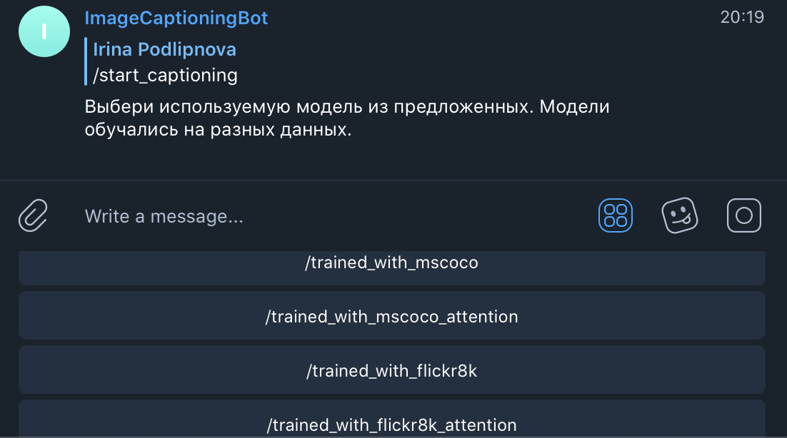
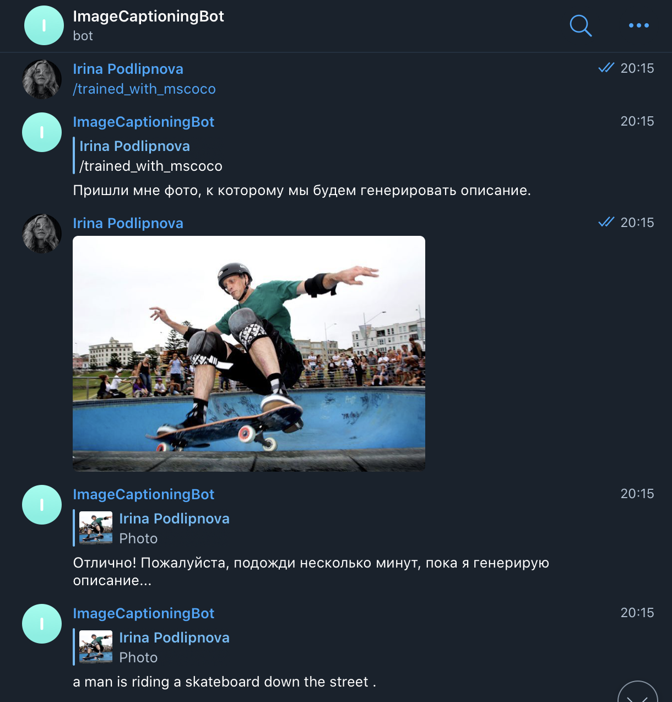

# Image Captioning Project

This repository is a final project of the second semester of Deep Learning School (DLS) course by MIPT.

## Implementation
The implementation according to given base script can be found in [Jupyter Notebook](https://github.com/ipodlipnova/ImageCaptioning/blob/main/Image_Captioning_Irina_Podlipnova.ipynb)
All necessary comments according to implementation can be found in this notebook.

The Telegram Bot was also implemented to show functionality.

## Usage

You can access bot by Telegram alias @neural_image_captioning_bot or [url](https://t.me/neural_image_captioning_bot).
Below are some examples of its work.

Bot suggests you to choose which model to use:


After choosing model to use you just need to send photo to the bot:


## How to launch
Feel free to try the bot. You will see some instructions and hints from the bot while using it.

Here is a docker-compose file to launch it. Just run 
```
docker-compose up --build
```
from the root directory of this project

## Contacts 
My telegram alias is @irinka19_08. Feel free to contact in case of any questions.


